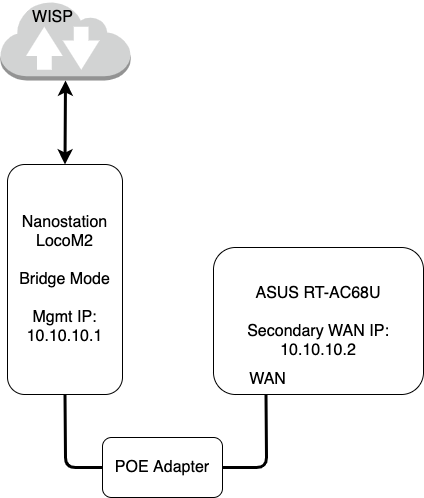

# asuswrt-merlin-configs
A documentation repo for how I'm using a Ubiquiti [Nanostation](https://www.ui.com/airmax/nanostationm/) as wireless bridge to provide WAN access to an ASUS [RT-AC68U](https://www.asus.com/ca-en/Networking/Wireless-Routers-Products/) router running [Asuswrt-Merlin](https://www.asuswrt-merlin.net/)

Since the Nanostation is in bridge mode, it has a management IP that cannot be seen unless an IP alias on the same management subnet is added to the ASUS router.

We can accomplish this via the [User-scripts](https://github.com/RMerl/asuswrt-merlin.ng/wiki/User-scripts) functionality.

This also allows the wireless bridge to use the WAN connection so that it can grab firmnware updates and contact NTP servers

 

